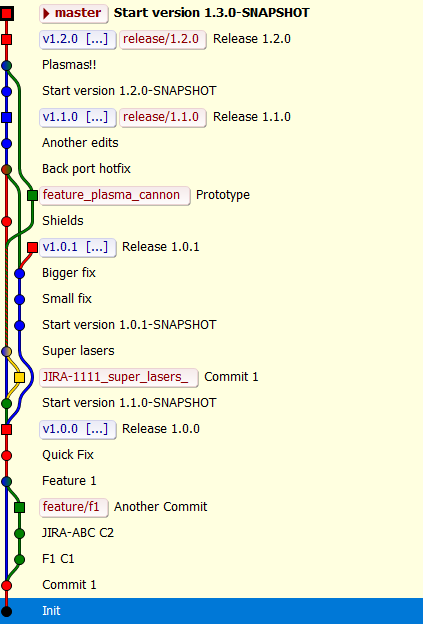

# Maven plugin to support classic branching model in git

### Introduction

The name of classic model is the reference to the [SVN pattern of branching](http://svnbook.red-bean.com/en/1.7/svn.branchmerge.commonpatterns.html). There are however a few modification to make sure that:

- the model simple and can be used and understand by everyone
- works well with Jenkins multi-branch jobs (automatic releases)
- can support release process without any CI
- suited for in-house development when complicated development process is not needed
- in natural way let support multiple production versions of the same artifact
- works well with maven and its versioning

The model is a compromise between an ad hoc branching and gitflow and helps to avoid suffering connected to maven versioning and tagging.

### Branches

Model uses the common name branches in git (names can be configured):
- `master` - the main branch where developmnet is happening. Developer can commit to this branch directly or use the feature branches. The main releases is taged in this branch.
- `release/x.x.x` - branches where `x.x.x` is a version of the product. Releases branches are support branches for versions which are still used and requires hot fixes. The releases created form the `master` have it minor version number (second number) incremented with the patch number set to 0 (third number). Releases created later in the release branch has its patch number incremented.
- `feature/xxxxx` - branches which are used to implement the new things for future releases. Thoes branches are merged into master when feature is done

### Tags

Every release is tagged. Under the tag there is a released version in any other commits the version is a SNAPSHOT
release tags are made on master if this is major release or on releases branches if this is a hotfix or maintenance

### Example

This is how repository looks like when model is used:

On the above picture we can see:

- there are a 3 features branches, each of them use different name pattern, all of them are already completed and merged (however the branches are not deleted for better visibility, but there is no point in keeping it)
- we have 3 major releases: 1.0.0, 1.1.0 1.2.0.
- it seems something goes wrong with 1.0.0 and there was fix applied to produce 1.0.1
- version 1.1.0 and 1.2.0 are still on production - theirs branches are active
- version 1.0.0 and 1.0.1 has its branches deleted, so they are archived versions
- fix made in release branch for 1.0.1 has been ported to the master

### Maven Goal

After the plugin is installed in local repository it is possible to use the following operations:

    git-classic:finish-feature
        Run this goal when you want to finish your current feature.
        Goal merges the current branch into main branch and removes the current
        branch.

    git-classic:finish-fix
        Use this goal when you want to conclude your work on a current
        hotfix. You should be in release branch you want to complete. Goal will set
        the new versions. Verify the build. And create a tag.

    git-classic:merge-fix
        Use this goal if you need to merge the selected fix to master
        Goal will create the branch from current commit and will equalize the
        version with main branch

    git-classic:release
        Use this goal when you want to make a new release for main
        branch. Goal will remove the snapshots versions, create a tag, create the
        support branch, and increment the snapshot version in main branch.

    git-classic:start-feature
        Use this goal to start new feature. The new feature will start
        form your current branch, but finish goal will always merged it to main
        branch. This is the only goal which doesn't require you to have no
        uncommitted changes.

    git-classic:start-fix
        Use this goal if you need to make the fix in current release
        (branch should be checkout) or start working on maintenance version. Goal
        will increment the maintenance version number. Work will continue on the
        current release branch.

